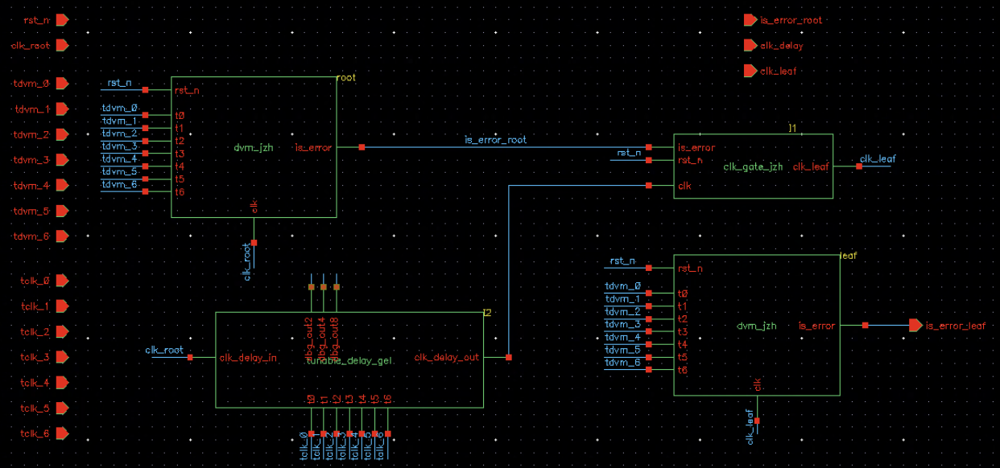
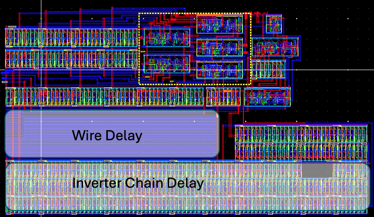
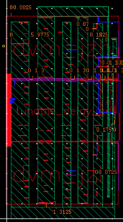
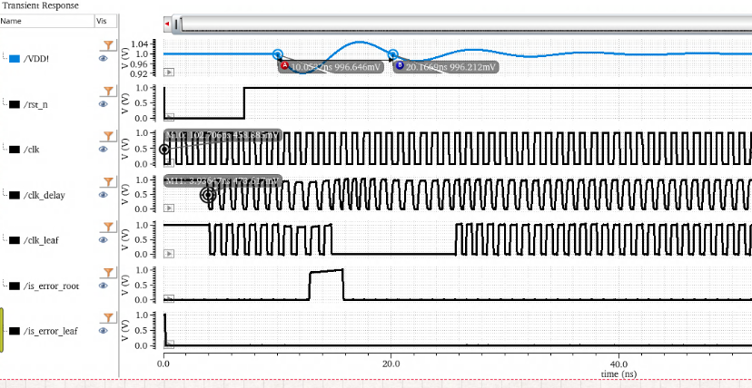
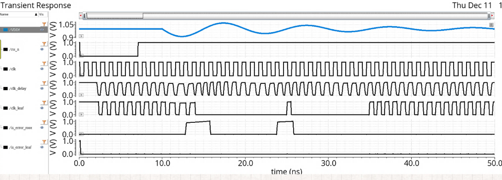
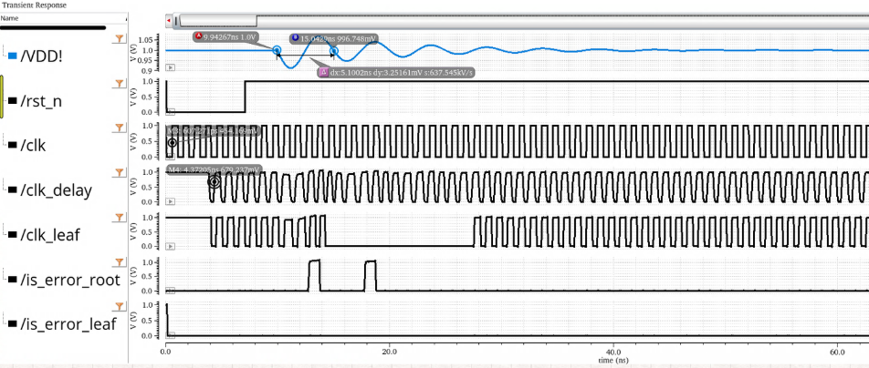

# PVT Tracking Sensors for Adaptive Clocking
**CE493: Advanced Low Power Digital and Mixed-signal Integrated Circuit Design**

**Authors:** Peixin Zhang (JZH2008), Willie Liao (GEL8580)  
**Date:** December 11, 2025

[View Final Project Report](report/CE493_Final_Report.pdf)

## Overview
This project implements an all-digital PVT (Process, Voltage, and Temperature) tracking sensor system designed to support an adaptive clock distribution network. The system specifically targets high-frequency supply voltage droops (50-333 MHz) that cause timing margin loss in high-performance processors.

The design is inspired by the 22 nm adaptive clocking architecture (Bowman et al., JSSC 2013) and features a full custom implementation in 45nm technology (GPDK045).



## Key Components

### 1. Dynamic Variation Monitor (DVM)
Detects Vcc droops by monitoring delay variations in a replica critical path.
- **Dual TRC (Transition Replica Chain):** Monitors both rising (0→1) and falling (1→0) edges to improve coverage across different transition sensitivities.
- **Robust Checker:** Samples TRC outputs and generates a one-cycle-delayed error pulse.
- **Metastability Protection:** Includes a two-stage synchronizer for all sensing outputs.

### 2. Tunable-Length Delay Chain
A configurable buffer chain used to adjust clock distribution delay and provide clock-data compensation.
- **Modes:** 2 ns, 4 ns, and 8 ns configurations.
- **Implementation:** Both transistor-dominated and interconnect-dominated paths (using lower metal layers for RC loading).

### 3. Adaptive Clock Gating
Dynamically gates the leaf clock during detected timing-error events.
- **Gating Window:** Asserted for at least 8 CPU cycles per event, resettable for extended droops.
- **Integrated Clock Gating (ICG):** Ensures glitch-free operation by updating gating signals only during the clock's low phase.

## Repository Structure

### RTL & Synthesis Flow
- `src/`: Verilog source files for the pipeline processor and adaptive logic.
- `src/tb/`: Testbenches for functional verification.
- `synthesis/`: Genus synthesis environment.
    - `scripts/`: Synthesis and simulation automation scripts.
    - `output_src/`: Gate-level netlists.
    - `reports/`: Timing and area reports.
- `constrs/`: Timing constraints and SDC files.
- `build/`: Working directory for simulation binaries.
- `waves/`: Saved simulation waveforms.

### Mixed-Signal & Backend Flow
- `virtuoso/pvt_sensor/`: Cadence Virtuoso library containing:
    - **Schematics:** Transistor-level designs for DVM, TRCs, and Tunable Delay.
    - **Layouts:** Custom handcrafted layouts with reinforced power grids.
    - **Maestro/States:** Simulation setups for Spectre transient analysis.
- `figures/`: Project figures and simulation waveforms for documentation.
- `waves/`: Simulation database files (e.g., `waves.shm`) and exported data.
- `calibre/`: Calibre DRC/LVS/PEX runset files and logs.
- `lib/`: Technology PDK (GPDK045) and standard cell libraries (gsclib045).

### Layout Insights

*Figure: Layout view of the tunable-length delay.*


*Figure: Reinforced power grid with Metal-3 straps to mitigate IR drop.*

## Implementation Workflow
1. **RTL Development:** Verilog design and functional verification via Xcelium.
2. **Synthesis:** Genus synthesis to gate-level netlist.
3. **Schematic Capture:** Manual transistor-level implementation in Virtuoso.
4. **Physical Design:** Fully custom layout with power-grid reinforcement (Metal-3 straps/via arrays) to resolve IR drop issues.
5. **Verification:** Custom Verilog-A modeling of Vcc-droops and post-layout RC-extracted transient simulations.

## Key Metrics (45nm)
| Metric | Value |
| --- | --- |
| DVM Area | 779 µm² |
| System Area | 2,723 µm² |
| Avg. Power | ~1.33 mW |
| Droop Freq Range | 50 MHz - 333 MHz |

## Simulation Results
The following waveforms demonstrate the adaptive clocking system's response to supply voltage droops under different configurations.

### 100 MHz Droop Case

*Figure: Simulation result under 100 MHz VCC droop with 4 ns tunable delay.*


*Figure: Simulation result under 100 MHz VCC droop with 2 ns tunable delay.*

### 200 MHz Droop Case

*Figure: Simulation result under 200 MHz VCC droop with 4 ns tunable delay.*

## Getting Started
To initialize the workspace and generate necessary directories:
```bash
make init
```
Refer to the `synthesis/Makefile` for one-click simulation and synthesis flows.